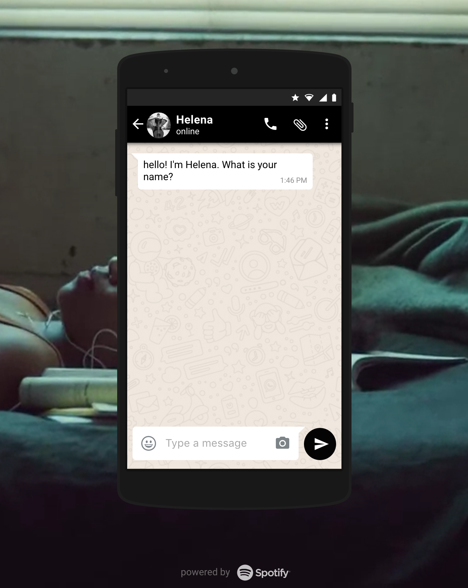

# [</img>](http://helena.guilherme.co.uk/)

> a lovely partner to help you discover music

### What is this?

Helena is a multi-service system that aims to give you the best music for what you are feeling right now. It used the [wit.ai](https://wit.ai/) to recognize some of the entities during the message exchange. It has a indexer process that keep fetching information from spotify and features from tracks. Also it uses a kNN classifier to identify the best music for the emotion that you provide.

### Why?

Don't you love music so much that sometimes you just wish to have someone to talk about it, and to give you a good hint on the next music to listen :) well, I do.

[</img>](docs/screen.png)